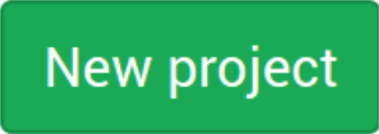
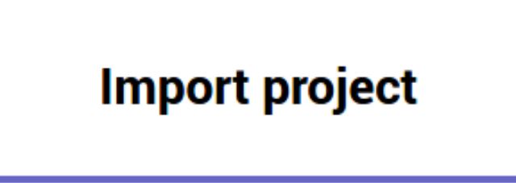
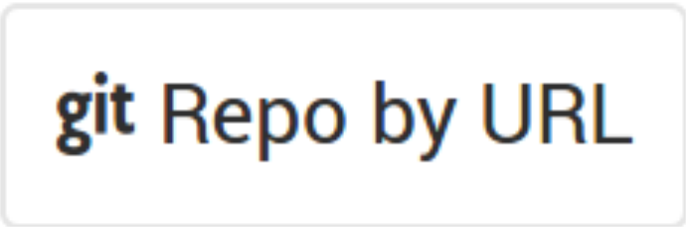
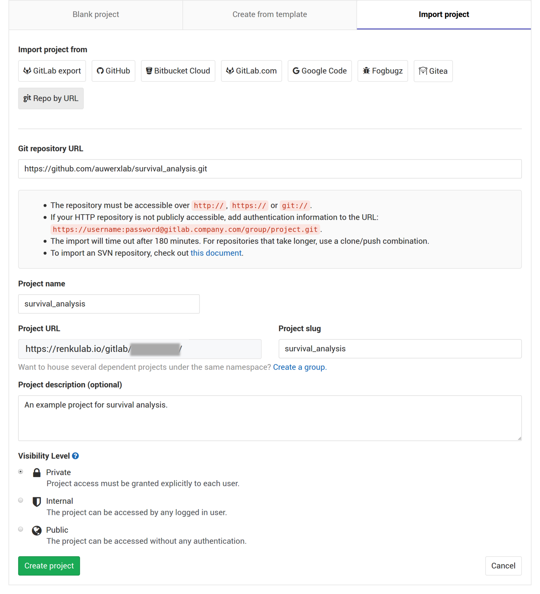
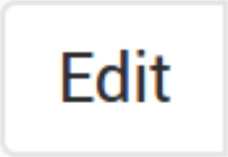
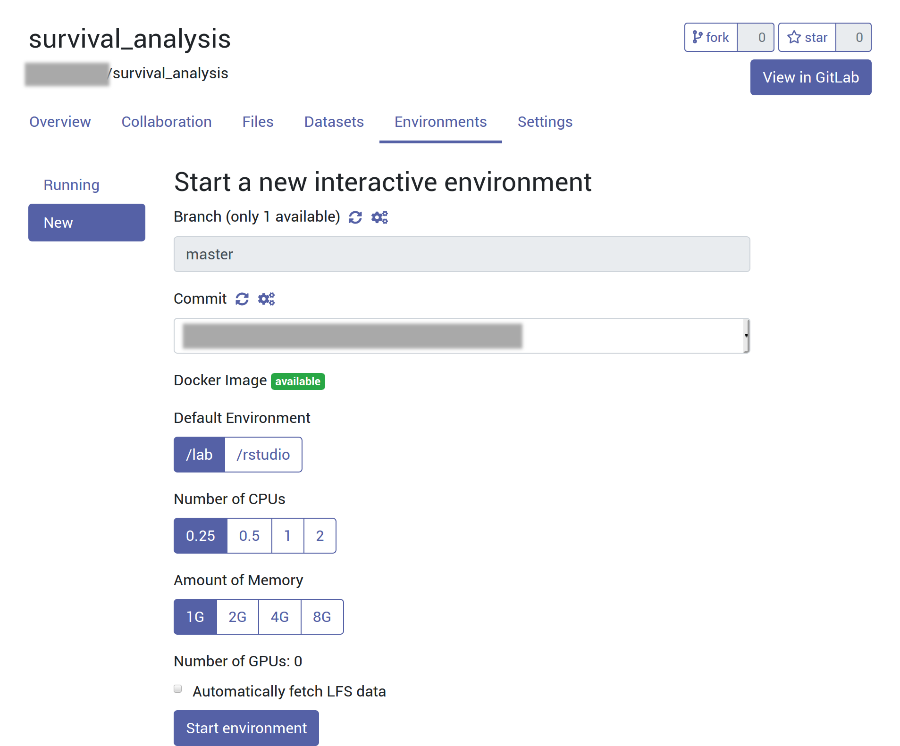

RENKU setup
===========

General settings to use this project in `RENKU <https://renkulab.io/>`_.

*Tested with RENKU release* `0.5.1 <https://github.com/SwissDataScienceCenter/renku/releases/tag/0.5.1>`_

Requirements
------------

With RENKU, all the requirements are automatically handled by the Dockerfile |:smiley:|.

Getting this R project
----------------------

Go to RENKU's GitLab then:  |button01| -> |button02| -> |button03|.

Use *https://github.com/auwerxlab/survival_analysis.git* as the ``Git repository URL`` and fill the other fields according to your needs:

.. note:: You need a first commit to trigger the build of the project's docker image.

A simple way to get a first commit is to update the README.rst with your author's information and a short description.
You can do it directly in GitLab by selecting the README.rst file and using the |button04| button.

Once you are done, click on |button05|.
This will trigger the build of the project's docker image - have a cup of |:coffee:| as this can take a while.

After creating the project in RENKU's GitLab, it will appear in your projects list in the RENKU web interface.

Launch a new Interactive Environment to start working on the project:

Keep track of your work
-----------------------

.. warning:: Understand what you are doing. Hosting your project on the wrong repository can expose sensitive information and data! |:boom:|

Renku uses GitLab/git for version control.

Tracking data and figures may be disabled by default. So modify the ``.gitignore`` file accordingly.
You can do so from a Terminal within a running Interactive Environment:

::

    $ sed -i "/data\/\*/d;/figs\/\*/d;/\*\.nb\.html/d" .gitignore

When you are ready to save changes made to the project, take a snapshot of all its files:

::

    $ git add -A

Then, commit the changes:

::

    $ git commit -m "<your_short_description>"

And finally, push the committed changes to the remote git repository in the RENKU GitLab:

::

    $ git push

.. include:: upstream.rst

.. include:: install_r_pkg.rst

This step is done automatically by the Dockerfile |:smiley:|.

When opening the project in RENKU for the first time, migrate the packrat libraries on the docker image using the python ``renku-r-tools`` package:

::

    $ renku-r ln-packrat-lib -p /home/rstudio/survival_analysis -s /home/rstudio/packrat

|:thumbsup:| That is it!
