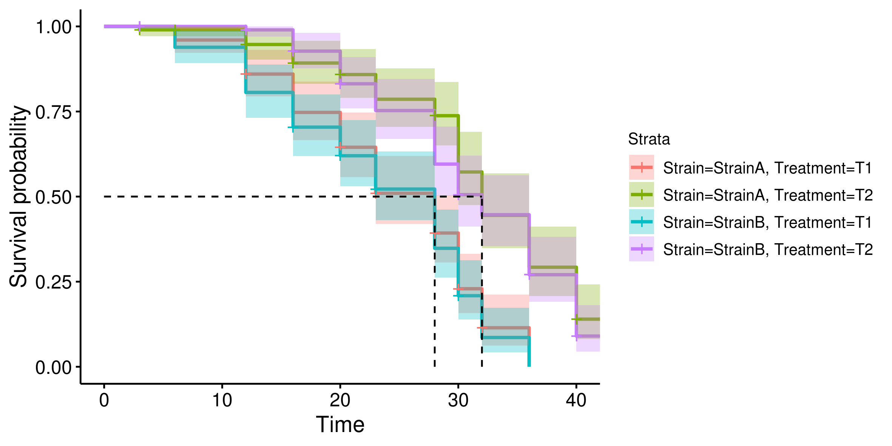
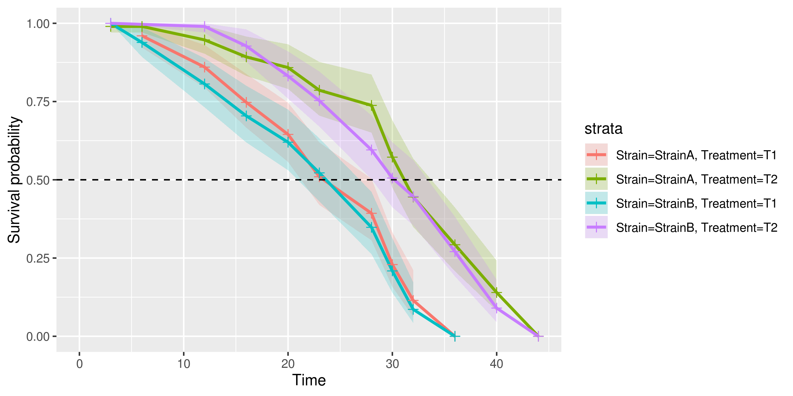
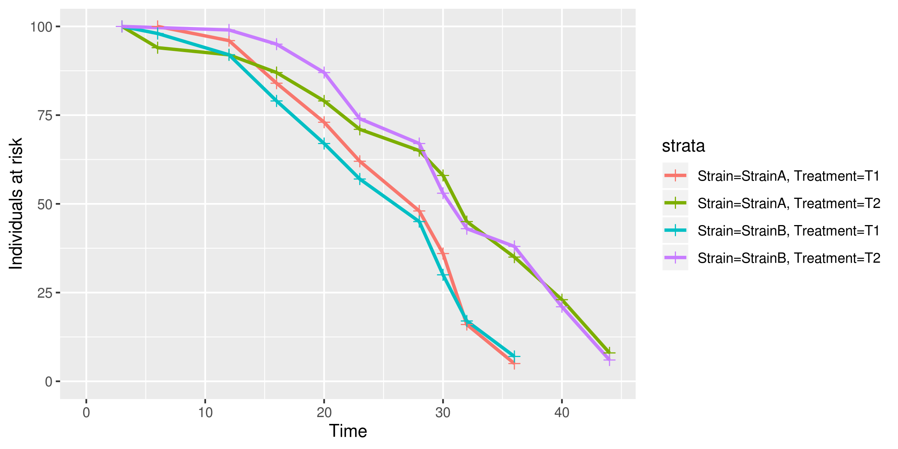
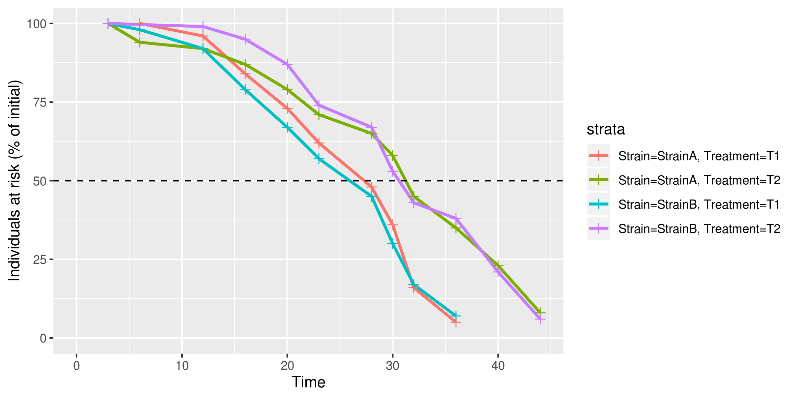
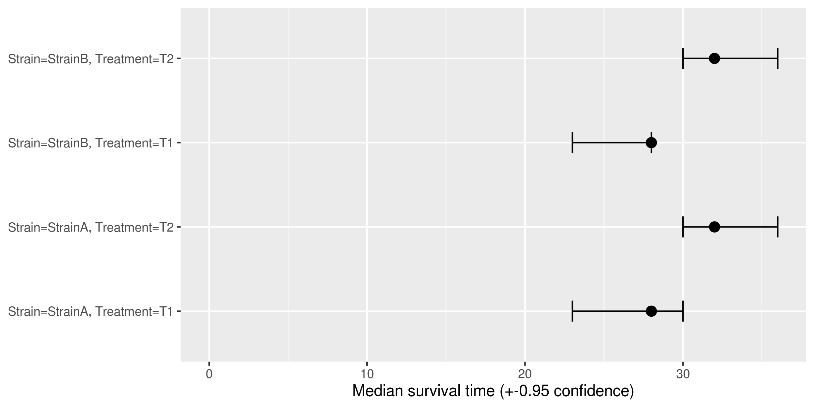
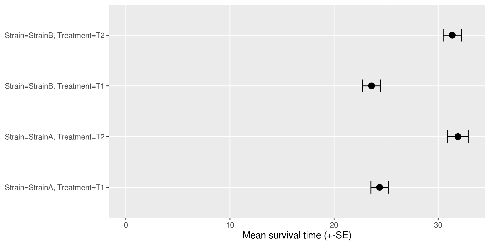
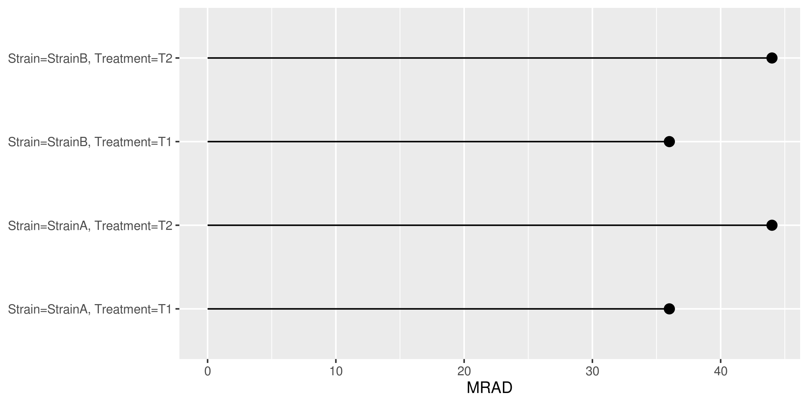
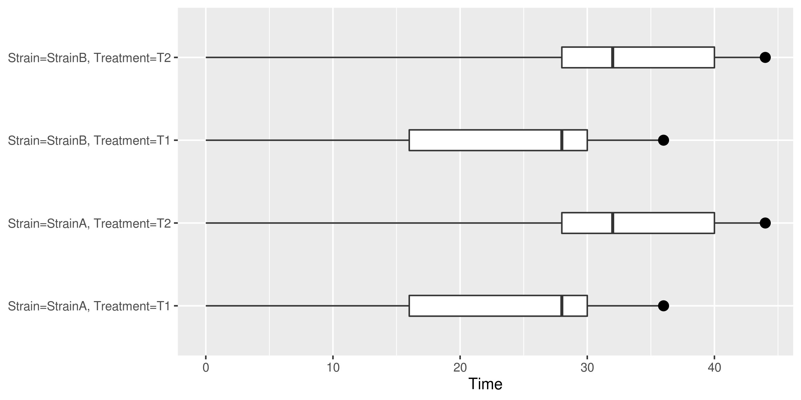
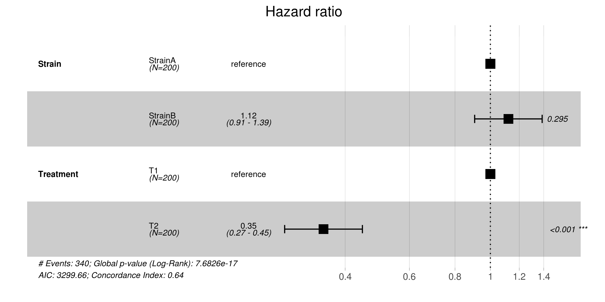

Tutorial
========

A hundred *Caenorhabditis elegans* worms belonging to two different strains (**StrainA** and **StrainB**) were submitted to two different treatments (**T1** and **T2**) along the course of six weeks.
The experimental design is summarized in the table below:

.. list-table::

    * - n
      - Strain
      - Treatment
    * - 100
      - StrainA
      - T1
    * - 100
      - StrainA
      - T2
    * - 100
      - StrainB
      - T1
    * - 100
      - StrainB
      - T2

This tutorial will use Kaplan-Meier survival curves and a Cox proportional hazards model to assess the effect of treatments **T1** and **T2** on strains **StrainA** and **StrainB**.

Dataset
-------

The :ref:`templates/survival_data_collection.xlsx` spreadsheet was used to collect counts of Dead/Censored *C. elegans* along the course of the experiment.

The resulting dataset is found in the `data/tutorial_data.xlsx <https://github.com/auwerxlab/survival_analysis/raw/master/data/tutorial_data.xlsx>`_ file.

If not done yet, open the `data/tutorial_data.xlsx <https://github.com/auwerxlab/survival_analysis/raw/master/data/tutorial_data.xlsx>`_ to check the format.

**Note: There are two sheets - see** :ref:`templates/survival_data_collection.xlsx` **for details.**

Analysis
--------

To fit the Kaplan-Meier survival curves and a Cox proportional hazards model, run the :ref:`bin/build_survival_curves.R` script.

Using the ``--model Strain+Treatment`` option will specify an additive linear model using "Strain" and "Treatement" as covariates.
These covariates were specified in the ``experimental_model`` sheet of the `data/tutorial_data.xlsx <https://github.com/auwerxlab/survival_analysis/raw/master/data/tutorial_data.xlsx>`_ file.

::

    $ bin/build_survival_curves.R --input_fp data/tutorial_data.xlsx --model Strain+Treatment --txt data/tutorial_data.txt --fig figs/tutorial.pdf --coxph data/tutorial_coxph.txt --km data/tutorial_km.txt

Results
-------

The results should look like:

::

    survival_analysis
    |── data
    |   |── tutorial_data.txt            A tidy data table
    |   |── tutorial_data.txt-PRISM.txt  PRISM.txt - A data table in a Graphpad Prism-compatible format
    |   |── tutorial_coxph.txt           The results of the Cox regression analysis
    |   └── tutorial_km.txt              A data table of variable for the Kaplan-Meier model
    └── figs
        |── tutorial.pdf                 The figures, including survival curves
        └── tutorial.rds                 The figures data in RDS format

The figures are found in the ``figs/tutorial.pdf`` file:

- Kaplan-Meier survival curves for each experimental group:

- A "linearized" version of the Kaplan-Meier survival curves, for visualization purposes:

- The number of individuals at risk for each experimental group:

- The number of individuals at risk as a percentage of initial experimental group size:

- The median survival time for each experimental group:

- The mean survival time for each experimental group:

- The maximal reported age at death (MRAD) for each experimental group:

- The survival time for each experimental group, with quartiles represented by boxes:

- The hazard ratio analysis for each experimental condition, with a global Log-Rank test p-value:

The results show that the treatment has an effect on the worms survival in both strains, while there is no significant differences in survival between the two observed strains of *C. elegans*.
